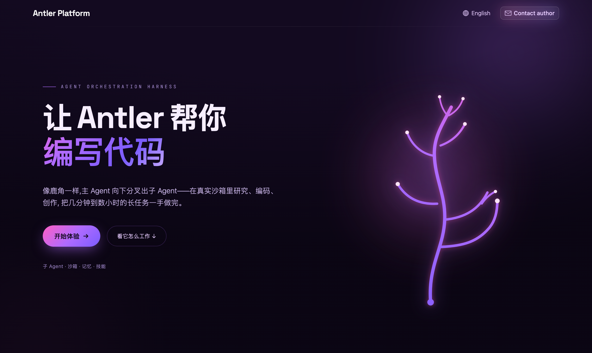

<div align="center">

# 🦌 Antler Platform

**一个会研究、会编码、会创作的超级智能体工作台**

像鹿角一样,主 Agent 向下分叉出子 Agent —— 在真实沙箱里研究、编码、创作,把几分钟到数小时的长任务一手做完。


</div>

> [!NOTE]
> **Antler Platform 是我在字节跳动开源框架 [DeerFlow](https://github.com/bytedance/deer-flow) 之上做的学习与二次开发项目**,用来熟悉 Agent 平台的应用搭建与工作流。核心 super-agent runtime 来自 DeerFlow(MIT);我在其上做了品牌重塑、前端体验重做与国际化改造,并借它深入理解 LangGraph 系多智能体架构。**这不是自研框架** —— 详见下方「致谢」。

<div align="center">
  
</div>

## ✨ 它能做什么

Antler Platform 是一套**代码级的 super-agent 工作台**:一个主 Agent 编排子 Agent、记忆、沙箱与可扩展技能(skills),去完成从几分钟到数小时的长任务 —— 深度研究、写代码、数据分析、生成网页 / 幻灯片 / 图片 / 播客等。

- 🌿 **子 Agent 编排** —— 主 Agent 把复杂任务分叉给一次性子 Agent(隔离上下文)
- 📦 **真实沙箱** —— 在受控沙箱里执行命令、读写文件、跑长任务
- 🧠 **长期记忆 + 上下文工程** —— 记录画像 / 要点,自动摘要保持上下文清爽
- 🧩 **技能 & 工具** —— 内置 + 自定义 `SKILL.md` 工作流 + MCP 工具
- 🔌 **多渠道接入** —— 同一个 Agent 可桥接飞书 / Slack / Telegram / Discord / 钉钉

## 🎨 我在 DeerFlow 之上做了什么

> 这部分是本项目相对上游的**改造与学习产出**(诚信标注)。

| 方向           | 内容                                                                                                                                     |
| -------------- | -------------------------------------------------------------------------------------------------------------------------------------- |
| **品牌重塑**   | 全站 DeerFlow → Antler Platform;保留对上游的诚信署名                                                                                    |
| **自研欢迎页** | 粉紫主题 + 「**鹿角 = Agent 编排树**」签名视觉:主干 = 主 Agent、角枝 = 子 Agent,加载时逐枝生长(纯 SVG + CSS,尊重 `reduced-motion`)  |
| **国际化**     | 新增繁體中文,做到 **English / 简体中文 / 繁體中文** 三语 + 落地页语言切换器                                                             |
| **模型接入**   | 配置 DeepSeek 作为 OpenAI-compatible provider                                                                                           |
| **架构精读**   | 梳理「一次请求如何流经 Gateway → LangGraph 图 → 子 Agent / 工具 / 沙箱 → SSE 流式返回」                                                  |

## 🏗️ 架构一览

- **Runtime**:不手搓 `StateGraph`,而是用 LangChain `create_agent()` 生成 ReAct 图,所有行为通过 `AgentMiddleware` 钩子(`wrap_model_call` / `before_model` / `after_model` / `wrap_tool_call`)分层叠加 —— 循环检测、token 预算、摘要压缩、澄清(HITL)、工具错误处理、工具输出治理等。
- **子 Agent**:`task` 工具派生一次性子图(独立 checkpointer)。
- **沙箱**:本地 / Docker / K8s 三种模式,命令黑名单 + 路径限制。
- **服务拓扑**:

| 服务        | 端口   | 角色                             |
| ----------- | ------ | -------------------------------- |
| Nginx       | `2026` | 统一入口 —— 浏览器打开这个        |
| Gateway API | `8001` | FastAPI + 内嵌 LangGraph runtime |
| Frontend    | `3000` | Next.js 界面                     |

## 🚀 快速开始(Docker)

```bash
git clone git@github.com:codeingforcoffee/antler-platform.git
cd antler-platform

make setup          # 交互向导:选模型 / 配搜索 / 沙箱安全项 → 生成 config.yaml + .env
make doctor         # 校验配置与环境

make docker-init && make docker-start   # 拉沙箱镜像 + 热重载
open http://localhost:2026
```

在 `config.yaml` 接入 DeepSeek(示例):

```yaml
models:
  - name: deepseek-chat
    display_name: DeepSeek V3
    use: deerflow.models.patched_deepseek:PatchedChatDeepSeek
    model: deepseek-chat
    api_key: $DEEPSEEK_API_KEY
```

`.env` 放 key:`DEEPSEEK_API_KEY=...`

> 更完整的部署说明见 [Install.md](Install.md) 与 [AGENTS.md](AGENTS.md)。

## 🧱 技术栈

- **后端**:Python 3.12+ · LangChain / LangGraph · FastAPI
- **前端**:Next.js 16 · React 19 · TypeScript · Tailwind v4
- **基础设施**:Docker 沙箱 · Nginx · MCP

## 🙏 致谢 / Built on

本项目站在巨人肩上,核心 runtime 与绝大部分能力来自 **[DeerFlow](https://github.com/bytedance/deer-flow)**(ByteDance,MIT)。衷心感谢 DeerFlow 及其作者,以及 LangChain / LangGraph / Next.js 等开源项目。

## 📜 License

MIT —— 与上游 [DeerFlow](https://github.com/bytedance/deer-flow) 保持一致。
